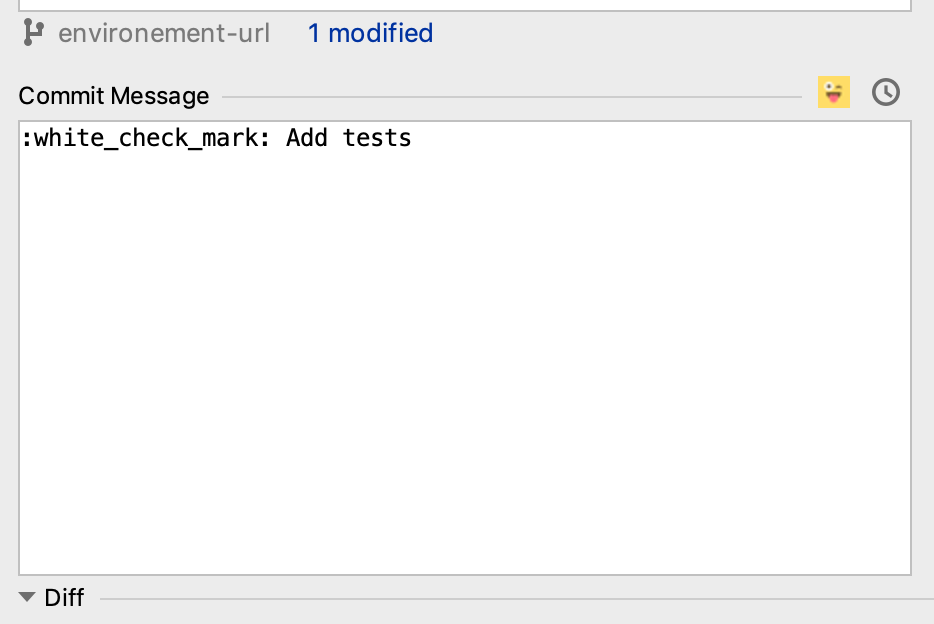
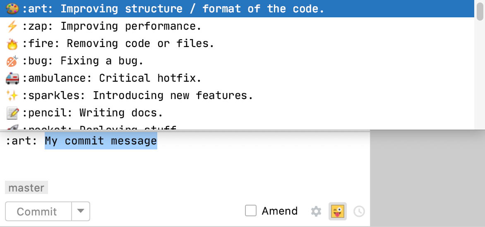
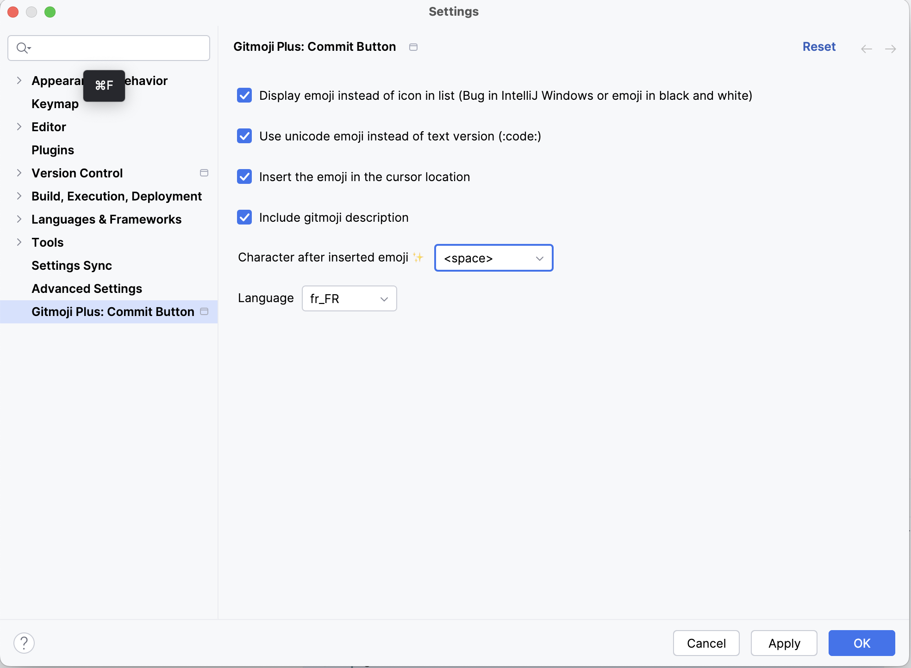

# Gitmoji Plus: Commit Button

Add a gitmoji emoticon in your commits to make them sexier!
This plug-in will help you to choose and add the gitmoji, via a button in the Commit window, among a predefined list of emoticons coming from [reference commit rules.](https://gitmoji.carloscuesta.me/)

## Features :

* Button near the Commit History Message allow to dispay the list of gitmoji
* Option to use the code (:sparkles:) or the unicode version (✨)
* Insert or replace the gitmoji before the message (keep the git commit message)
* Shortcut to open the list : ctrl alt g (or cmd alt g on mac)
* Load the list of gitmoji on startup from the repos of gitmoji (fallback to a local list if error).

See the [gitmoji website](https://gitmoji.carloscuesta.me/) for have the list of Emoji and their signification.

## Installation

https://plugins.jetbrains.com/plugin/12383-gitmoji/

In IntelliJ, go to preference, then Plugins, and search Gitmoji by Patrice de Saint Steban.
After install, and restart, you will have a button on the commit dialog.

## Contrib

You can contrib by adding [issues](https://github.com/patou/gitmoji-intellij-plugin/issues/new), or create pull request.

- Import the project in IntelliJ.
- Write your code
- Use graddle tasks runIde to run and test the plugin

## Publish plugin

First time, copy gradle.properties.sample to gradle.properties

- Go to https://hub.jetbrains.com/users/me?tab=authentification
- Create a new token with Plugin Repository
- Copy the generated token in the gradle.properties

Execute the publishPlugin gradle task

## Inspiration plugin

This plugin was inspired from the plugin created by @biezhi : https://github.com/biezhi/gitmoji-plugin.
Thanks for is works.
