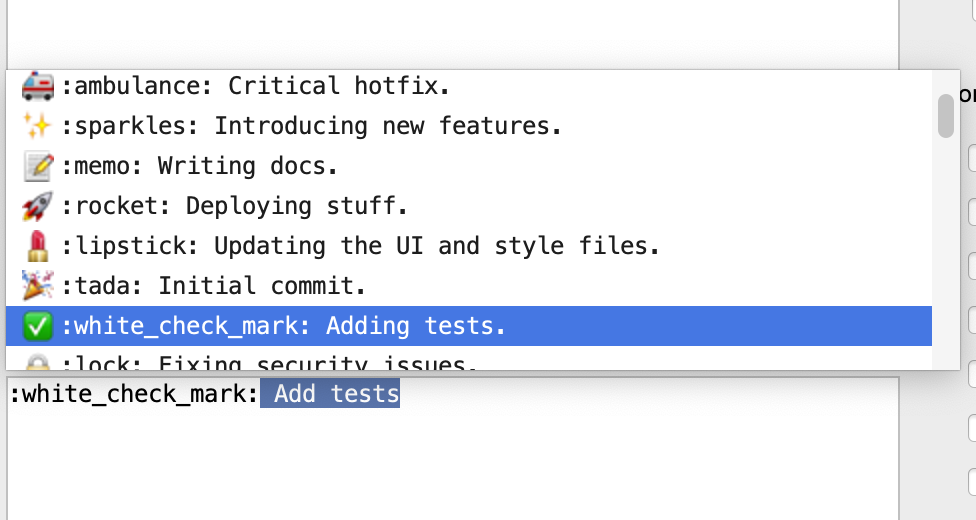

# gitmoji-intellij-plugin

Intellij plugin for add a button on the commit dialog to add gitmoji.
An option allow to insert the unicode character directly.

See the [gitmoji website](https://gitmoji.carloscuesta.me/) for have the list of Emoji and their signification.

## Installation

https://plugins.jetbrains.com/plugin/12383-gitmoji/

In IntelliJ, go to preference, then Plugins, and search Gitmoji by Patrice de Saint Steban.
After install, and restart, you will have a button on the commit dialog.

## Contrib

You can contrib by adding [issues](https://github.com/patou/gitmoji-intellij-plugin/issues/new), or create pull request.

- Import the project in IntelliJ.
- Write your code
- Use graddle tasks runIde to run and test the plugin

## Publish plugin

First time, copy gradle.properties.sample to gradle.properties

- Go to https://hub.jetbrains.com/users/me?tab=authentification
- Create a new token with Plugin Repository
- Copy the generated token in the gradle.properties

Execute the publishPlugin gradle task
